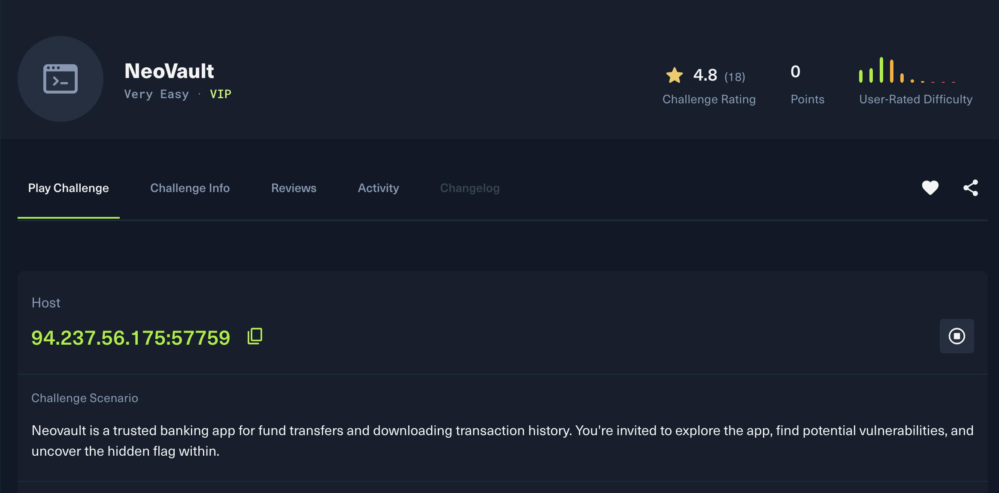
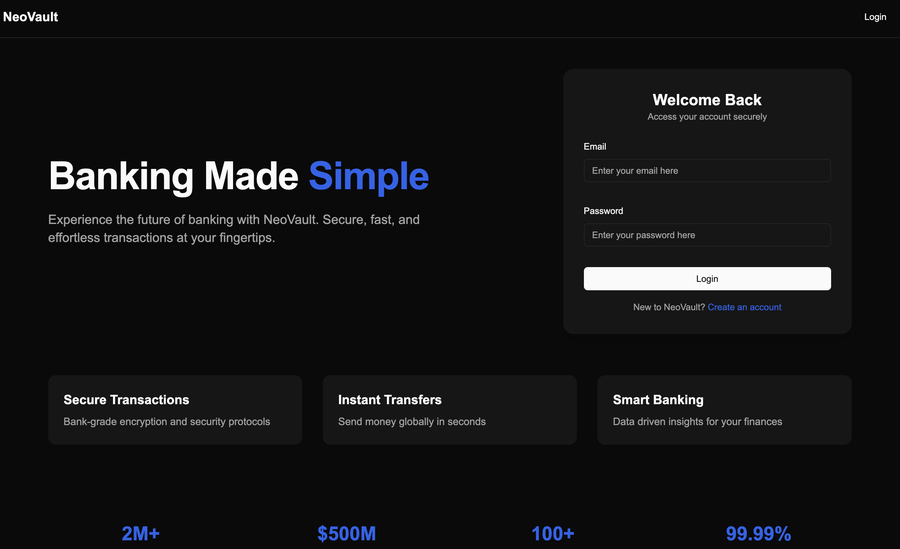
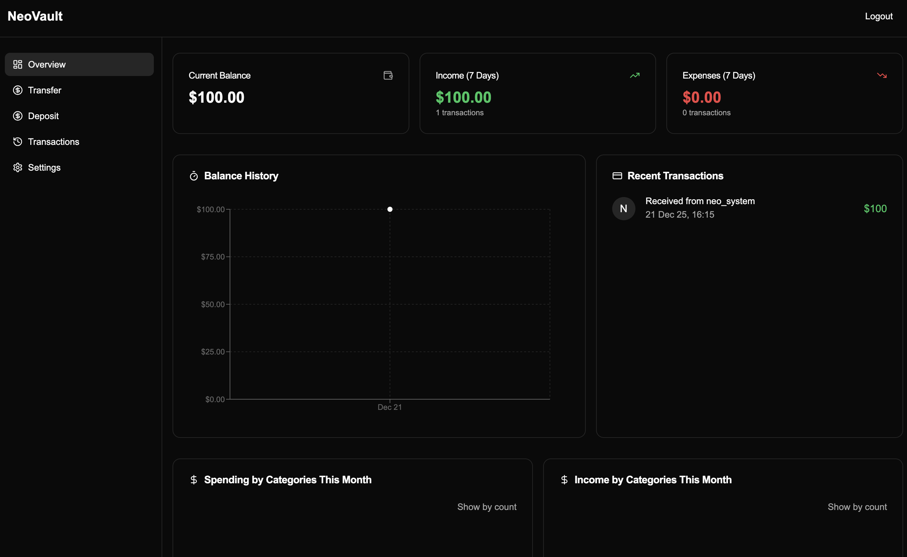
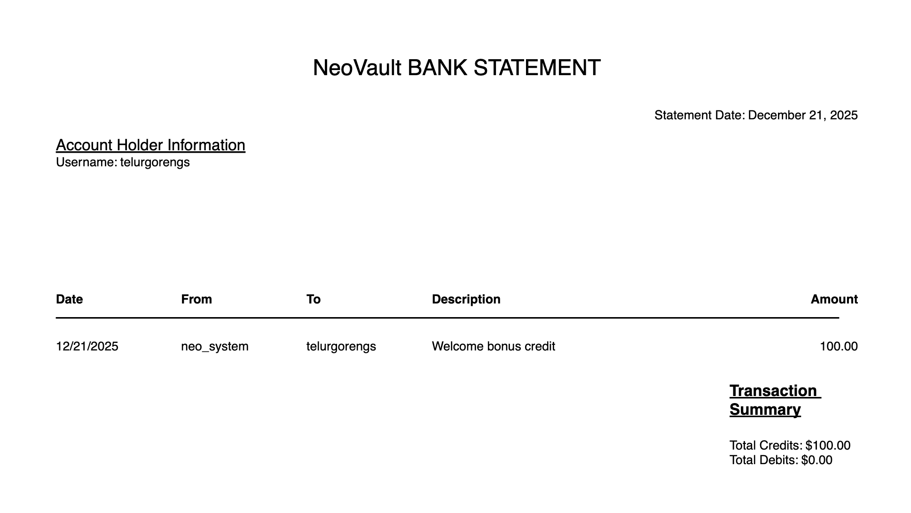
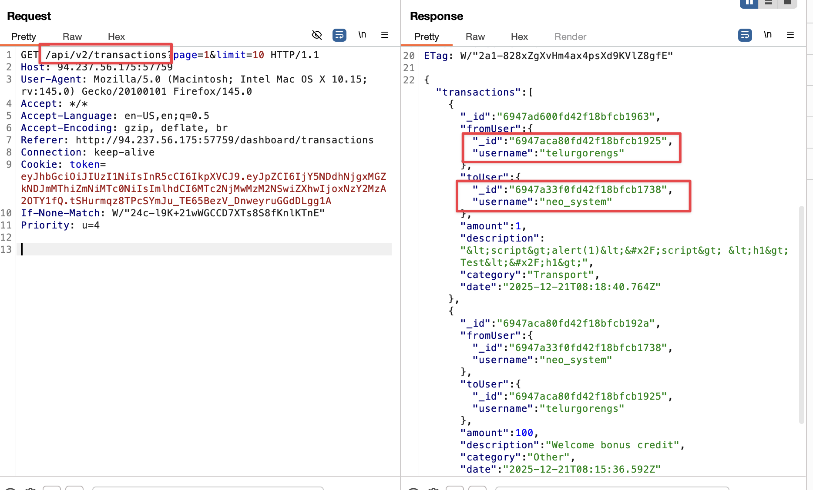
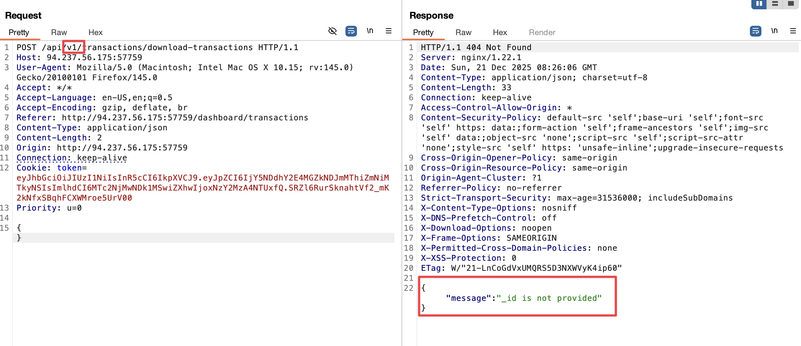
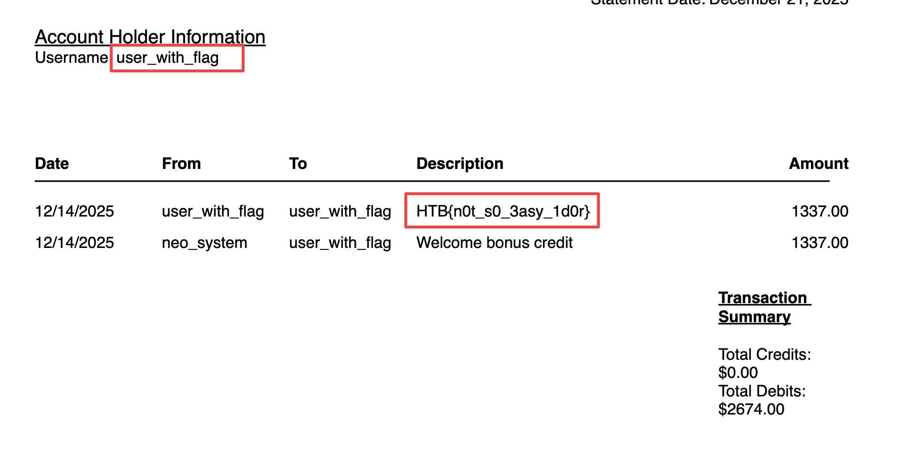

# HTB NeoBank Writeup

## Overview

**Platform**: HackTheBox  
**Difficulty**: Easy  
**Vulnerabilities**: IDOR, BOLA, API Versioning  

NeoBank is a web application challenge that demonstrates how legacy API endpoints can introduce critical security flaws. The exploitation chain involves identifying an older API version (`v1`) that lacks proper object-level authorization (IDOR), leveraging information leakage to enumerate user IDs, and ultimately accessing another user's financial report to retrieve the flag.



---

## Authentication & Initial Access

The application presents a login and registration interface.



### Testing Login Security
Standard SQL injection payloads (`' OR 1=1--`) and authentication bypass attempts on the login form were unsuccessful.


### Account Creation
A legitimate test account was created to access the authenticated area of the application.




---

## Reconnaissance & Information Disclosure

### Username Enumeration
The transaction history on the dashboard discloses the usernames of other entities, specifically `neo_system`.



### API Endpoint Discovery
Reviewing the HTTP history in Burp Suite revealed distinct API versions being used:

- `/api/v1/user/details` - Returns user information.
- `/api/v2/download-report` - Handles financial report downloads.

The presence of `v1` and `v2` endpoints suggests multiple API versions exist, making the legacy `v1` endpoints a potential attack surface.



---

## Exploitation

### Vulnerability 1: API Version Downgrade (IDOR)

Analyzing the `/api/v2/download-report` request showed it relies on the session cookie to identify the user.

Switching the request to the legacy endpoint `/api/v1/download-report` returned an error:
```json
{"error": "Missing required parameter: _id"}
```

This error indicates that the `v1` endpoint expects a user-controlled `_id` parameter, unlike `v2` which derives the user identity from the session. This is a classic Insecure Direct Object Reference (IDOR) vulnerability.



### Vulnerability 2: User Enumeration Chain

To exploit the IDOR, a valid target `userid` is required. The `/api/v1/user/details` endpoint was found to allow querying user details by username.

**Attack Step 1: Get Target User ID**
Using the username `neo_system` found in the transaction history:
```http
GET /api/v1/user/details?username=user_with_flag HTTP/1.1
```
(Initially tested with `neo_system`, which revealed the flag user's username is likely `user_with_flag` or similar, or the `neo_system` report itself contained a reference).

*Correction based on previous findings*: Accessing `neo_system`'s report revealed a transaction with `user_with_flag`.


**Attack Step 2: Download Victim Report**
With the `userid` for `user_with_flag` obtained, the IDOR on the download endpoint can be triggered:

```http
GET /api/v1/download-report?_id=<target_userid> HTTP/1.1
Cookie: session=<valid_session>
```



### Flag Retrieval
The response contains the financial report for the target user, which includes the flag.

```
HTB{flag_content_here}
```

---

## Remediation

The root cause is the failure to disable or secure the legacy `v1` API endpoint which implemented insecure authorization checks.

1.  **Deprecate and Remove Legacy Endpoints**: Old API versions (`v1`) should be disabled if they are no longer needed.
2.  **Implement Object-Level Authorization**: Ensure that the authenticated user is authorized to access the requested resource ID.
3.  **Avoid Direct Object References**: Use indirect references (like session-based ID retrieval) rather than trusting user input for resource identification.